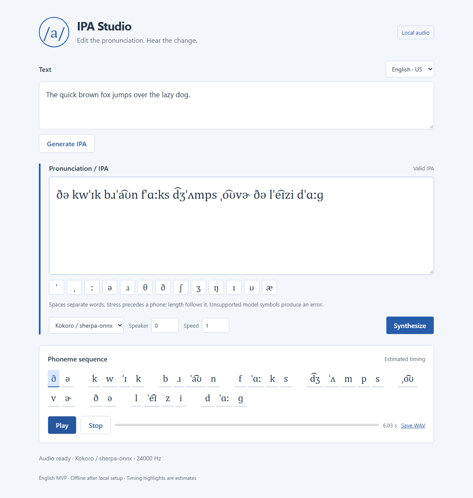

<!-- SPDX-License-Identifier: CC-BY-4.0 -->
# IPA-first TTS MVP

一个可运行的 Rust workspace：文本先变为结构化 IPA，用户直接编辑 IPA，再把音素送入本地 Kokoro / sherpa-onnx。**`ipa-core` 不依赖 Kokoro、sherpa-onnx 或 UI。**

首期支持英语（en-US / en-GB）。语言标识为开放字符串，`zh`、`ja`、`fr`、`de` 可以由新 backend 启用；当前入口会明确拒绝这些语言，避免声称已经支持。

UI 是 Rust 提供的 loopback 浏览器界面，使用原生 HTML/CSS/JavaScript，无 npm、CDN、React 或 Tauri 依赖。这样先跑通 IPA-first 流程；以后可以在相同 Rust API 外加 Tauri 壳。所有字体为系统字体，安装完成后运行不依赖网络。



## 下载并运行 / Windows x64

从 [GitHub Releases](https://github.com/styayur/ipa-first-tts/releases/latest) 下载 `ipa-first-tts-v0.1.0-windows-x64-offline.zip`。在 Windows 10/11 x64 上完整解压后双击 `Start-IPA-Studio.cmd`，打开终端打印的本地地址。这个包包含 Kokoro 模型、eSpeak-NG、匹配的 sherpa/ONNX Runtime DLL 和应用目录内的 Microsoft VC++ runtime，无须安装 Rust、Python、Node 或 VC++ Redistributable，也无须联网。

关闭终端或按 Ctrl+C 结束服务器。命令行操作可在解压目录运行：

```powershell
.\ipa-tts.exe doctor
.\ipa-tts.exe demo outputs\quick-brown-fox.wav kokoro
.\ipa-tts.exe synth "ˈʃiː" outputs\edited.wav kokoro
```

下载包后，可用 `Get-FileHash .\ipa-first-tts-v0.1.0-windows-x64-offline.zip -Algorithm SHA256` 与同一 Release 的 `SHA256SUMS.txt` 比对。`corresponding-source.zip` 提供应用源码、Cargo vendored 依赖和 native 上游源码；源码获取与许可证边界见 [THIRD_PARTY_NOTICES.md](THIRD_PARTY_NOTICES.md)。

## Quick start / Windows

需要 Rust stable MSVC、Visual Studio C++ Build Tools / Windows SDK，以及 Windows 的 `curl.exe` 和 `tar.exe`。所有命令均在此项目根目录运行：

```powershell
git clone https://github.com/styayur/ipa-first-tts.git
cd ipa-first-tts
pwsh -File scripts/setup.ps1
cargo build --workspace --locked
cargo run -p ipa-desktop -- doctor
cargo run -p ipa-desktop -- serve
```

在浏览器打开程序打印的 [本地地址](http://127.0.0.1:17842)。源码仓库不包含模型或工具二进制；源码构建时先运行 setup，完整 Release 包则已经包含这些资产。

1. Text 中输入文本，点击 **Generate IPA**。
2. 编辑 IPA；输入时自动执行 Unicode 规范化和校验。符号按钮插入到光标处。
3. 点击 **Synthesize**；Kokoro 接收编辑后的音素。默认 speaker 0，speed 1。
4. 点击 **Play / Stop**，或 **Save WAV** 保存音频。
5. 下方显示结构化音素序列。高亮依据均匀估算，界面明确标注 `Estimated timing`。

若端口冲突，可运行 `cargo run -p ipa-desktop -- serve 17843`。UI 只绑定 `127.0.0.1`，必须使用打印的准确地址；不开放 CORS。

## Architecture

```text
ipa-first-tts/
├── Cargo.toml / Cargo.lock
├── crates/
│   ├── ipa-core/         Unicode parser、IPA IR、validation、normalization、G2pBackend
│   ├── g2p-espeak/       eSpeak-NG G2P、英语音素合成 fallback
│   ├── tts-core/         TtsBackend、PhonemeAdapter、Audio、PCM16 WAV
│   ├── tts-kokoro/       Kokoro 词表 adapter、sherpa-onnx CPU 推理
│   └── alignment-core/  Aligner、TimingQuality、显式的估算 timing
├── apps/desktop/
│   ├── src/             CLI、本地 HTTP UI、应用编排
│   ├── ui/              文本和 IPA 编辑、播放、音素显示
│   └── tests/pipeline.rs 真实 eSpeak / Kokoro 集成测试
├── scripts/
│   ├── setup.ps1        Windows 便携版 eSpeak / 模型准备
│   ├── test_ui.py       使用真实 backend 的 Playwright 测试
│   └── package_release.py  离线包和源码包制作
├── licenses/           完整许可证文本、作用范围和第三方通知
├── models/README.md     模型格式和准备说明
├── tools/              本地工具（忽略提交）
└── outputs/            实际生成的 WAV、界面截图、验证结果
```

依赖方向：

```text
apps/desktop ──> g2p-espeak ──> ipa-core
             ├─> tts-kokoro ──> tts-core ──> ipa-core
             └─> alignment-core ──> tts-core / ipa-core
```

核心 trait 为 Rust trait（不是 Kotlin）：

```rust
// ipa-core
pub trait G2pBackend {
    fn name(&self) -> &str;
    fn generate(&self, text: &str, language: &str) -> Result<IpaSequence, String>;
}
// tts-core
pub trait PhonemeAdapter {
    fn adapt(&self, ipa: &IpaSequence) -> Result<ModelPhonemes, String>;
}
pub trait TtsBackend {
    fn name(&self) -> &str;
    fn synthesize(&self, ipa: &IpaSequence, options: SynthesisOptions) -> Result<Audio, String>;
}
// alignment-core
pub trait Aligner {
    fn align(&self, ipa: &IpaSequence, audio: &Audio) -> Result<Alignment, String>;
}
```

`TtsBackend` 的输入没有原始文本，从接口层面防止悄悄忽略用户编辑后重新执行 G2P。`ModelPhonemes` 保存模型 token 和来源 IR 索引；Kokoro 特有映射全部在 adapter 内。

IR：

```rust
pub struct IpaSequence {
    pub language: Option<String>,
    pub phones: Vec<IpaPhone>,
}
pub struct IpaPhone {
    pub symbol: String,
    pub stress: Option<Stress>,
    pub kind: PhoneKind, // Phone / WordBoundary / Punctuation
    pub start_ms: Option<f32>,
    pub end_ms: Option<f32>,
}
```

词边界为显式 `WordBoundary` 条目，canonical 输出为一个空格；音标修饰符属于前一个 phone。绑定音 `t͡ʃ`、双元音 `a͡ʊ` 为单个 IR 条目；无需把模型 token 粒度强加给 IPA Core。

直接依赖为 serde、serde_json、unicode-normalization、tiny_http，以及可选 sherpa-onnx。WAV 编码使用 Rust 标准库。应用和核心均 `forbid(unsafe_code)`；第三方 sherpa 安全封装内部的 FFI 是唯一涉及 unsafe 的运行边界。

## IPA pipeline

```text
Text
  -> eSpeak-NG CLI (--ipa=2, en-us / en-gb)
  -> IpaSequence::parse / Canonical IPA
  -> 用户编辑 IPA
  -> Unicode NFD / validation
  -> KokoroAdapter + tokens.txt 验证
  -> 编辑后音素的临时 lexicon
  -> sherpa-onnx / Kokoro / CPU
  -> 单声道 PCM16 WAV / 浏览器播放
```

Core 接受 `/.../` 和 `[...]` 外壳、Unicode IPA、组合附加符、主重音 `ˈ`、次重音 `ˌ`、长音 `ː`、半长音 `ˑ`、tie bar、词边界和基本标点。规范化包含 NFD、ASCII `g` → IPA `ɡ`、两种 tie bar 合并、连续空白折叠、`|` → 词边界。重音附到下一 phone，长音附到上一 phone。重新规范化会清除旧 timing。

校验拒绝空音序列、未识别字符、悬空重音/附加符、重复长音、损坏的 IR、负数/NaN/非单调 timing。它是**基础语法和结构校验**，不是完整 IPA 或语言音系校验。错误中的字符位置指向规范化后的 IPA。

Kokoro adapter 将 `t͡ʃ` → `ʧ`、`d͡ʒ` → `ʤ`、英语绑定双元音 → 模型 Unicode tokens、`ɚ` → `əɹ`、`ɝ` → `ɜɹ`。不支持的音素明确报错，不会静默删除，也不会自动切换 backend。

### 确保编辑直接进入模型

sherpa-onnx 常规 `generate(text)` 会执行 G2P。此项目用只含本次发音的临时词典，将 `ipawordaa` 等纯字母 alias 映射到模型音素。针对锁定的 1.13.8 runtime，还必须清空私有模型副本中的 `voice` 元数据，才能进入 lexicon 分支。原始 ONNX 和权重不被修改。准备器对 opaque graph 字节原样流式复制，单元测试验证只改此 metadata。

每次 synthesis 重新建立 native session，让新词典生效。推理关闭 silence scaling，减少额外音频修改。临时资源由 RAII 在正常退出时清理。详细机制见 [模型说明](models/README.md)。

## 如何安装 eSpeak-NG

Windows 推荐 `scripts/setup.ps1`：固定版本 1.52.0 MSI，由 lessmsi 2.12.9 提取为便携目录 `tools/espeak-ng/`，不需要系统安装或管理员权限。也可手动从 [官方 releases](https://github.com/espeak-ng/espeak-ng/releases/tag/1.52.0) 安装，并设置：

```powershell
$env:ESPEAK_NG = 'C:\Program Files\eSpeak NG\espeak-ng.exe'
```

必须保留 exe 旁的 `espeak-ng-data/`；程序自动传递 `--path`。官方 Windows 1.52.0 在本机执行 `--version` 会崩溃，因此 `doctor` 使用真实 `hello` G2P 检查。

Linux：`sudo apt install espeak-ng`；macOS：`brew install espeak-ng`。或者把可执行文件放入 PATH。`ESPEAK_NG` 覆盖自动发现路径。

## 如何准备 Kokoro / sherpa-onnx

Windows 运行 `scripts/setup.ps1`，下载 sherpa 的 `kokoro-multi-lang-v1_0` bundle。也可按 [models/README.md](models/README.md) 手动下载和解压。默认目录含 `model.onnx`、`voices.bin`、`tokens.txt`、`espeak-ng-data/`。此 MVP 不使用随 bundle 下载的英语/中文大型 lexicon，而只生成本次输入的极小词典。

```powershell
$env:KOKORO_MODEL_DIR = 'D:\models\kokoro-multi-lang-v1_0'
```

Rust 依赖固定 `sherpa-onnx = 1.13.8`，使用官方 **shared** CPU runtime。首次 `cargo build` 时，第三方 build script 会下载匹配的 native libraries；编译后 runtime DLL 自动复制到 `target/debug/` 或 `target/release/`。Windows 分发时，必须把生成的所有 runtime DLL 与 `ipa-tts.exe` 放在一起，不能只复制 EXE。

构建本身可以联网准备依赖；运行不会联网。完全离线构建需要提前缓存 Cargo 依赖/native archive，或设置 `SHERPA_ONNX_LIB_DIR` 指向匹配版本的本地库，随后使用 `cargo build --offline --locked`。不匹配的 ORT DLL 可能导致 native 崩溃；不要混用其他项目的 DLL。

## CLI / 示例

```powershell
cargo run -p ipa-desktop -- g2p "The quick brown fox jumps over the lazy dog."
cargo run -p ipa-desktop -- demo outputs/quick-brown-fox.wav kokoro
cargo run -p ipa-desktop -- synth "ˈʃiː" outputs/edited.wav kokoro
```

本次验证的示例 IPA：

```text
ðə kwˈɪk bɹˈa͡ʊn fˈɑːks d͡ʒˈʌmps ˌo͡ʊvɚ ðə lˈe͡ɪzi dˈɑːɡ
```

实际结果为 24 kHz、约 6.03 秒的 Kokoro 音频，保存在 `outputs/quick-brown-fox.wav`。eSpeak 版本/口音不同，IPA 可能略有不同。

### 最小 fallback

不安装模型或 native runtime 也能跑通真实语音流程：

```powershell
pwsh -File scripts/setup.ps1 -SkipModel
cargo run -p ipa-desktop --no-default-features -- serve
cargo run -p ipa-desktop --no-default-features -- demo outputs/fallback.wav espeak
```

eSpeak fallback 将编辑后的英语 IPA 转为 eSpeak mnemonic `[[...]]` 音素输入，再生成本地语音；不是假音频，也不是 Kokoro。未知音素报错。fallback 固定 en-US、speaker 0，声质明显更机械。

## Build / Test

```powershell
cargo build --workspace --locked
cargo test --workspace --locked
cargo test -p ipa-desktop --test pipeline -- --ignored --test-threads=1
cargo clippy --workspace --all-targets -- -D warnings
```

普通 `cargo test` 不要求本地模型，真实集成测试标为 ignored，需要显式运行。它们使用真实 eSpeak G2P、fallback 和 Kokoro CLI；验证 WAV、采样率、非静音、IPA 编辑影响、未知模型音素错误。Kokoro 集成用 public CLI 子进程，让 Windows 优先载入 EXE 旁的匹配 DLL，避免 `target/debug/deps` 下的测试进程误载系统自带旧 ORT。

独立测试 Core / 最小构建：

```powershell
cargo test -p ipa-core --offline
cargo test -p ipa-desktop --no-default-features --offline
```

真实 UI 测试可选：在 `ipa-tts serve` 运行期间，执行 `python scripts/test_ui.py`。需要 Python Playwright 和 Chromium（只用于开发测试，不是应用运行依赖）。该测试验证生成、修改、实际 Kokoro 合成、浏览器播放、Stop、估算高亮、错误处理和 390 px 布局，并写出 `outputs/ui-verification.json` 和截图。

## 当前限制

- 实测平台为 Windows x64。Rust 核心无 OS 专属依赖；Linux/macOS 的 native runtime 和音频播放尚未实测。
- UI 为本地浏览器应用，尚未提供原生 Tauri 窗口或安装包。
- 仅英语；eSpeak 发音与 Kokoro 训练用的 Misaki 发音前端不完全一致。
- Core 支持常见 IPA 字符的保守 inventory，不涵盖全部历史/扩展 IPA；不检查英语音系合法性。
- 本地 G2P text 上限 4096 UTF-8 bytes，UI IPA 上限 8192 bytes，Kokoro 上限 480 model tokens；长文需拆分。
- `--ipa=2` 可能不保留原文标点。用户可在 IPA 中补入标点；MVP 没有独立 prosody IR。
- timing 全部是均匀估算，**不是模型时长或 forced alignment**。不能用于发音评分。
- 每次 utterance 重新载入 session/词典，延迟和内存占用高于缓存普通 TTS session；先保证编辑有效。可通过 `IPA_TTS_DEBUG=1` 查看 native tokens。
- 单进程顺序执行，合成期间 UI 等待；Stop 停止音频播放，不取消正在进行的 native inference。
- native runtime 对损坏/不匹配资产可能直接退出或崩溃，MVP 做路径、元数据、词表与参数检查，尚未把 UI 推理隔离到 worker 进程。
- HTTP 音频缓存只保存最新 4 条，服务器重启后失效。保存 WAV 可长期保留。

## Roadmap

1. 以稳定的音素/token 推理桥替代临时词典，缓存 Kokoro session；将推理放入可重启 worker，支持取消。
2. 保留现有 crates，为 UI 加 Tauri 壳和原生安装包；扩展 Linux/macOS runtime 实测。
3. 加入模型真实 duration 或 `MFA` forced aligner，通过 `Aligner` 返回 `Model` / `Forced` timing。
4. 为 zh / ja / fr / de 增加可测试的 G2P 与 backend adapter；IPA Core 保持模型无关。
5. 新增 Piper `TtsBackend`；WikiPron / Epitran `G2pBackend`，无需修改 IPA Core。

不包含训练、voice cloning、STT、AI chat、云 API、用户系统、完整语言学习功能或自建大型 pronunciation database。

## Upstream references

- [eSpeak-NG](https://github.com/espeak-ng/espeak-ng)
- [sherpa-onnx Kokoro 模型说明](https://k2-fsa.github.io/sherpa/onnx/tts/pretrained_models/kokoro.html)
- [锁定 runtime 的 Kokoro frontend 调用](https://github.com/k2-fsa/sherpa-onnx/blob/v1.13.8/sherpa-onnx/csrc/offline-tts-kokoro-impl.h)
- [Kokoro lexicon frontend](https://github.com/k2-fsa/sherpa-onnx/blob/v1.13.8/sherpa-onnx/csrc/kokoro-multi-lang-lexicon.cc)

## License

依照 [Stya Yur Open Source Studio License Policy](https://github.com/styayur/styayur/blob/main/LICENSE_POLICY.md)，按组件用途授权：

| 组件 | 许可证 |
|---|---|
| `apps/desktop/` 完整应用、CLI、UI、应用测试与组合可执行程序 | **GPL-3.0-or-later** |
| `crates/` 五个独立、可复用 Rust 库 | **MPL-2.0** |
| `scripts/` 与 CI 自动化 | **MIT** |
| 独立编写的 README / Markdown 文档 | **CC BY 4.0** |
| Kokoro 模型、eSpeak-NG、sherpa-onnx、ONNX Runtime、依赖和第三方数据 | **保留各自原许可证** |

Copyright © 2026 **Stya Yur Open Source Studio**。根目录 [LICENSE](LICENSE) 覆盖应用；可复用库的 Cargo metadata、各 crate 的 LICENSE 和源码 SPDX header 明确标为 MPL-2.0。MPL 文件未声明不兼容 secondary licenses，组合为 GPL 应用时适用 MPL 2.0 §3.3。文档引用请标注作者和本仓库链接，注明修改，并链接 CC BY 4.0。

完整边界、授权文本和来源见 [licenses/README.md](licenses/README.md)、[NOTICE](NOTICE) 和 [THIRD_PARTY_NOTICES.md](THIRD_PARTY_NOTICES.md)。第三方模型、数据、字体、代码与二进制不会因本项目许可证而被重新授权；无第三方字体随包分发。
